<h1 align="left">Denis Samatov</h1>

**Machine Learning Engineer · Production LLM/RAG & Agentic AI · Technical Lead · Scientific ML & Medical Imaging**

<picture>
  <source media="(prefers-color-scheme: dark)" srcset="readmefile/dark.svg">
  <source media="(prefers-color-scheme: light)" srcset="readmefile/light.svg">
  
</picture>

I build production ML/AI systems that turn complex documents, domain data, and research methods into testable, traceable software. My current focus is LLM/RAG architecture, agentic workflows, MCP integrations, evaluation, and reliability, with research-to-production depth in scientific ML and medical imaging.

## Selected evidence

| Project | Role in the portfolio | Verifiable evidence |
|---|---|---|
| [**Yandex Workspace MCP**](https://github.com/denis-samatov/yandex-workspace-mcp) | Flagship production/open-source engineering | Typed MCP tools, read-only defaults, permission gates, audit logging, CI, Docker, security and deployment documentation |
| [**Tensor-Based Modal Decomposition**](https://github.com/denis-samatov/tensor-based-modal-decomposition-method) | Scientific ML and research software | Tucker/HOSVD, sparse sensor placement, tests, benchmarks, reproducibility guide, citation metadata, [arXiv preprint](https://arxiv.org/abs/2607.09687) |
| [**LLM Adviser case study**](https://github.com/denis-samatov/llm-adviser-case-study) | Architecture and technical leadership | Sanitized production case study covering traceability, evaluation, async execution, reliability boundaries, and documented limitations |

Additional domain evidence: **EPIFAT**, officially registered cardiac CT segmentation software (No. 2025610317), with an automated segmentation and manual ROI-correction workflow; related medical-imaging code remains private.

## Engineering scope

- **Technical leadership:** architecture and delivery across three applied AI platforms; coordination of a five-engineer team while remaining hands-on.
- **Production AI:** Python, FastAPI, Redis, Docker, CI/CD, observability, document processing, hybrid retrieval, reranking, GraphRAG, grounded generation, and MCP integrations.
- **Scientific ML:** tensor decomposition, reduced-order modeling, sparse sensing, Bayesian inference, MCMC, and reproducible experiments.
- **Medical AI:** PyTorch, semantic segmentation, U-Net/Attention U-Net, cardiac CT/MRI, radiomics, and human-in-the-loop review.

## Experience snapshot

- **Machine Learning Engineer / Technical Lead**, *Analytics and Machine Learning Department, MSUU* (`Apr 2024 – Present`) — architecture and delivery across CourseLLM, Modular RAG Platform, and LLM Adviser; coordinating a five-engineer team.
- **Data Scientist / Research ML Engineer**, *Heriot-Watt TPU Center* (`Sep 2024 – Present`) — Bayesian parameter-space appraisal, tensor-based reduced-order modeling, and QR sparse-sensor placement.
- **Machine Learning Engineer**, *Cardiology Research Institute* (`Mar 2021 – May 2026`) — EPIFAT cardiac CT segmentation software and medical-imaging research workflows.

Full role scope and employment details: [LinkedIn](https://www.linkedin.com/in/denis-samatov).

## Selected external contributions

- [IBM/docling-pipelines #31](https://github.com/IBM/docling-pipelines/pull/31) — submitted a fix for dry-run prerequisite probing in example tests.
- [VectifyAI/PageIndex #483](https://github.com/VectifyAI/PageIndex/pull/483) — submitted plain-text parsing and indexing support.
- [weaviate/weaviate-python-client #2153](https://github.com/weaviate/weaviate-python-client/pull/2153) — submitted generative DigitalOcean support.
- [dragonflydb/dragonfly #8199](https://github.com/dragonflydb/dragonfly/pull/8199) — submitted an `FT.INFO` missing-index compatibility fix.

These links show submitted work; each pull request page is the source of truth for its current review or merge status.

## Research identity

- [arXiv:2607.09687](https://arxiv.org/abs/2607.09687) — *Tensor-Based Modal Decomposition and Sparse Sensor Placement for the Brugge Field Simulation Model*.
- [Digital Diagnostics](https://jdigitaldiagnostics.com/DD/article/view/630602) — cardiac MRI radiomics research.
- [ORCID](https://orcid.org/0009-0000-1821-323X) — complete research identity and publication record.
- [Google Scholar](https://scholar.google.com/citations?user=GvQy91AAAAAJ) — publication and citation profile.

## Contact

Open to Machine Learning Engineer, Applied AI Engineer, and Technical Lead opportunities, as well as research and open-source collaboration.
