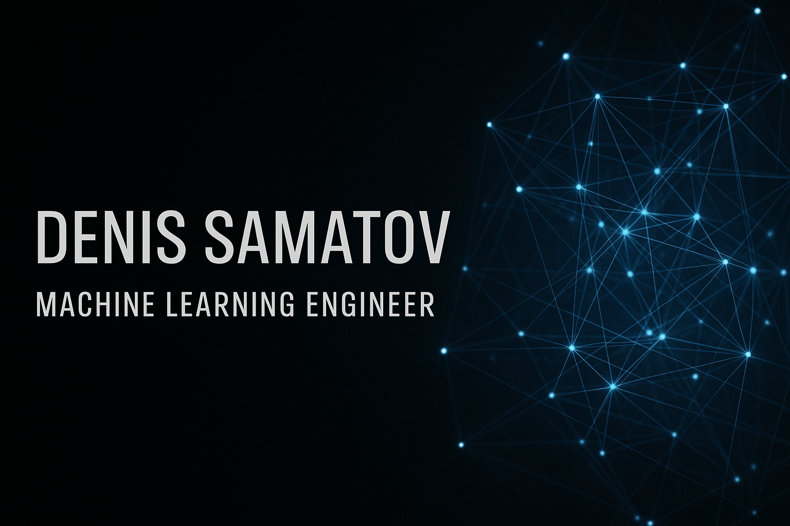

  

<h1 align="center">Denis Samatov</h1>

  <strong>Applied AI / Deep Learning Engineer | Medical Imaging, Computer Vision, LLM/RAG & Scientific ML</strong>

  I build research-driven ML systems for medical imaging, radiomics, scientific computing and applied AI workflows.
  My work connects deep learning, computer vision, tensor-based methods, retrieval systems and backend tooling into reproducible engineering pipelines.

  <a href="mailto:denissamatov470@gmail.com">Email</a> ·
  <a href="https://t.me/SamatovDS">Telegram</a> ·
  <a href="./CV_SamatovDS.pdf">CV</a> ·
  <a href="https://github.com/denis-samatov">GitHub</a>

---

## Core Expertise

- **Medical AI & Radiomics** — CT/MRI analysis, segmentation pipelines, epicardial adipose tissue analysis and quantitative radiomic feature extraction.
- **Computer Vision** — image segmentation, preprocessing, annotation workflows, OCR/table extraction and model evaluation.
- **LLM/RAG Systems** — retrieval pipelines, embeddings, vector search, applied NLP workflows and AI assistant architecture.
- **Scientific ML & Tensor Methods** — tensor decomposition, dimensionality reduction and spatio-temporal modeling for scientific and engineering data.
- **Applied ML Engineering** — data processing, model validation, experiment tracking, backend services and reproducible research code.

---

## Selected Work

### EPIFAT — Epicardial Fat Segmentation & Radiomics

Automated segmentation and radiomic analysis of epicardial adipose tissue on cardiac CT scans.

**Stack:** Python, PyTorch, U-Net, Attention U-Net, OpenCV, PyRadiomics  
**Result:** State-registered software module, **Rospatent No. 2025610317, 2025**

---

### Radiomics for Cardiovascular Imaging

Research-oriented workflow for myocardial polar map segmentation, radiomic feature extraction and patient classification experiments.

**Stack:** Python, Jupyter, U-Net, K-means, Otsu thresholding, PyRadiomics, classical ML  
**Repository:** [denis-samatov/radiomics](https://github.com/denis-samatov/radiomics)

---

### Tensor-Based Methods for Reservoir Modeling

Low-dimensional representations for high-dimensional spatio-temporal simulation data in reservoir modeling and scientific computing.

**Stack:** Python, NumPy, TensorLy, tensor decomposition, scientific computing

---

### HR Analytics — Salary Forecasting System

Applied analytics system for collecting, processing and forecasting salary data from HeadHunter API sources.

**Stack:** Python, Flask, FastAPI, Playwright, Docker, Celery, Redis

---

### OCR / Table Extraction from Financial Reports

Computer vision and OCR pipeline for extracting tabular data from PDF/image-based financial reports into structured CSV output.

**Stack:** Python, OpenCV, PyMuPDF, Tesseract OCR, NumPy, Matplotlib  
**Repository:** [denis-samatov/recognition_russian_financial_reports](https://github.com/denis-samatov/recognition_russian_financial_reports)

---

## Tech Stack

**ML / Deep Learning:** PyTorch, TensorFlow, scikit-learn, Transformers, Hugging Face  
**LLM / NLP / RAG:** LangChain, LlamaIndex, SentenceTransformers, FAISS, Pinecone  
**Computer Vision:** OpenCV, Albumentations, CVAT, PyRadiomics  
**Scientific Computing:** NumPy, Pandas, PyArrow, TensorLy, Matplotlib, Plotly  
**Data / Backend:** FastAPI, Flask, SQL, PostgreSQL, Redis, Celery  
**MLOps / Tools:** Docker, GitHub Actions, MLflow, Weights & Biases, S3-compatible storage  

---

## Research & Publications

- **Tensor-Based Modal Decomposition for Reservoir Study Optimization**, Conference Paper, 2025.
- **Automatic Image Segmentation and Quantitative Assessment**, XXI International Conference “Perspectives of Fundamental Sciences Development”, 2024.
- **Radiomic Analysis of Cardiac MRI Images in Cine Mode**, *Digital Diagnostics Journal*, 2024.
- **Beam Parameters Restoration at the NICA Accelerator Complex**, *START, JINR*, 2023.

For a complete academic and engineering background, see my [CV](./CV_SamatovDS.pdf).

---

## Engineering Principles

- Build reproducible ML workflows, not only notebooks.
- Validate models with clear metrics, baselines and error analysis.
- Keep research code understandable, documented and reusable.
- Prefer modular pipelines that can evolve into services, APIs or deployable tools.

---

## Contact

I am open to **ML/AI engineering roles, research engineering positions and applied AI collaborations** in medical AI, computer vision, LLM/RAG systems, scientific ML and AI for Science.

**Email:** [denissamatov470@gmail.com](mailto:denissamatov470@gmail.com)  
**Telegram:** [@SamatovDS](https://t.me/SamatovDS)  
**CV:** [CV_SamatovDS.pdf](./CV_SamatovDS.pdf)

---

  
GitHub activity

  

    
    
  

