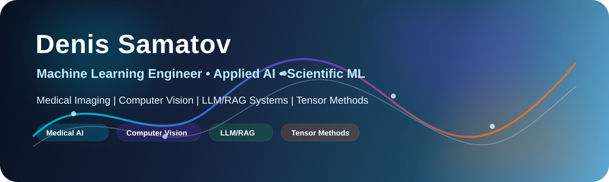

  

<h1 align="center">Denis Samatov</h1>

  <strong>Machine Learning Engineer building applied AI systems for medical imaging, scientific computing and production ML workflows.</strong>

  <a href="mailto:denissamatov470@gmail.com">Email</a> ·
  <a href="https://t.me/SamatovDS">Telegram</a> ·
  <a href="./CV_SamatovDS.pdf">CV</a> ·
  <a href="https://github.com/denis-samatov">GitHub</a>

---

## What I Build

I work at the intersection of **deep learning**, **computer vision**, **medical image analysis**, **LLM/RAG systems** and **scientific machine learning**. My focus is not only model training, but complete ML workflows: data preprocessing, validation, reproducibility, backend services and deployment-oriented engineering.

| Medical AI | Computer Vision | LLM/RAG | Scientific ML | ML Engineering |
|---|---|---|---|---|
| CT/MRI analysis | segmentation & OCR | retrieval pipelines | tensor methods | reproducible pipelines |
| radiomics | image preprocessing | vector search | sensor placement | backend ML services |
| clinical workflows | annotation workflows | AI assistants | spatio-temporal data | validation & automation |

---

## Selected Work

### Applied RAG & Recruitment Analytics

Internal AI systems for document retrieval, salary monitoring and multimodal candidate evaluation at MSUU.

**Focus:** RAG, information retrieval, HR analytics, recommender systems, backend ML services  
**Result:** Automated retrieval, monitoring and candidate assessment workflows.

---

### EPIFAT — Epicardial Fat Segmentation

Automated segmentation and radiomic analysis of epicardial adipose tissue on cardiac CT scans.

**Stack:** PyTorch, U-Net, Attention U-Net, OpenCV, PyRadiomics  
**Result:** State-registered software module, **Rospatent No. 2025610317, 2025**

---

### Medical Image Segmentation

End-to-end CT/MRI image processing pipelines for automated segmentation and early pathology analysis at the Cardiology Research Institute.

**Stack:** PyTorch, U-Net, Attention U-Net, OpenCV, radiomics  
**Result:** 40% lower image processing time; 80%+ segmentation accuracy.

---

### Tensor-Based Scientific ML

Reduced-order modeling and tensor-based methods for high-dimensional spatio-temporal scientific data at Heriot-Watt TPU Center.

**Focus:** tensor decomposition, optimal sensor placement, forecasting, reservoir modeling  
**Result:** Algorithms for complexity reduction and decision-support workflows.

---

### Particle Track Reconstruction

ML algorithms for beam parameter restoration and particle track reconstruction at the NICA accelerator complex.

**Focus:** computational physics, multi-track beam analysis, reconstruction optimization  
**Result:** 25% faster reconstruction; 12% better multi-track analysis efficiency and accuracy.

---

### OCR / Table Extraction

Computer vision and OCR pipeline for extracting tables from PDF/image-based financial reports into structured CSV output.

**Stack:** OpenCV, PyMuPDF, Tesseract OCR, NumPy, Matplotlib  
**Repository:** [recognition_russian_financial_reports](https://github.com/denis-samatov/recognition_russian_financial_reports)

---

## Tech Stack

**ML / Deep Learning:** PyTorch, TensorFlow, scikit-learn, Transformers, Hugging Face  
**LLM / NLP / RAG:** LangChain, LlamaIndex, SentenceTransformers, FAISS, Pinecone  
**Computer Vision:** OpenCV, Albumentations, CVAT, PyRadiomics  
**Scientific Computing:** NumPy, Pandas, PyArrow, TensorLy, Matplotlib, Plotly  
**Data / Backend:** FastAPI, Flask, SQL, PostgreSQL, Redis, Celery  
**MLOps / Tools:** Docker, GitHub Actions, MLflow, Weights & Biases, S3-compatible storage  

---

## Research, Publications & Recognition

**Selected publications and technical outputs**

- **Tensor-Based Modal Decomposition for Reservoir Study Optimization**, Conference Paper, 2025.
- **Automatic Image Segmentation and Quantitative Assessment**, XXI International Conference “Perspectives of Fundamental Sciences Development”, 2024.
- **Radiomic Analysis of Cardiac MRI Images in Cine Mode**, *Digital Diagnostics Journal*, 2024.
- **Beam Parameters Restoration at the NICA Accelerator Complex**, *START, JINR*, 2023.

**Selected recognition**

- Winner, **Artificial Intelligence and Machine Learning Track**, FINODays Hackathon.
- Special nomination winner, **National Technology Olympiad**, Computer Vision Technologies and Digital Services track.
- Prize winner, **MIPT Educational Forum Hackathon** in AI, Mathematics and Physics.
- Second-degree diploma, presentation on automatic segmentation and radiomic assessment in cardiac CT.

For a complete academic and engineering background, see my [CV](./CV_SamatovDS.pdf).

---

## Education

- **Tomsk Polytechnic University** — Master’s Degree, Applied Mathematics and Computer Science, 2024–Present.
- **Tomsk Polytechnic University** — Bachelor’s Degree, Applied Mathematics and Computer Science, 2020–2024.
- **Skoltech / Skolkovo Institute of Science and Technology** — Professional Development Course, Generative Models based on Adversarial Learning, 2024.
- **Tomsk Polytechnic University** — Professional Retraining Diploma, Data Science and Machine Learning, 2023–2024.

---

## Engineering Principles

> Research quality + engineering discipline: reproducible pipelines, explicit validation, readable code, modular design and deployment-aware ML systems.

---

## Contact

I am open to **ML/AI engineering roles, research engineering positions and applied AI collaborations** in medical AI, computer vision, LLM/RAG systems, scientific ML and AI for Science.

**Email:** [denissamatov470@gmail.com](mailto:denissamatov470@gmail.com)  
**Telegram:** [@SamatovDS](https://t.me/SamatovDS)  
**CV:** [CV_SamatovDS.pdf](./CV_SamatovDS.pdf)

---

  
GitHub activity

  

    
    
  

