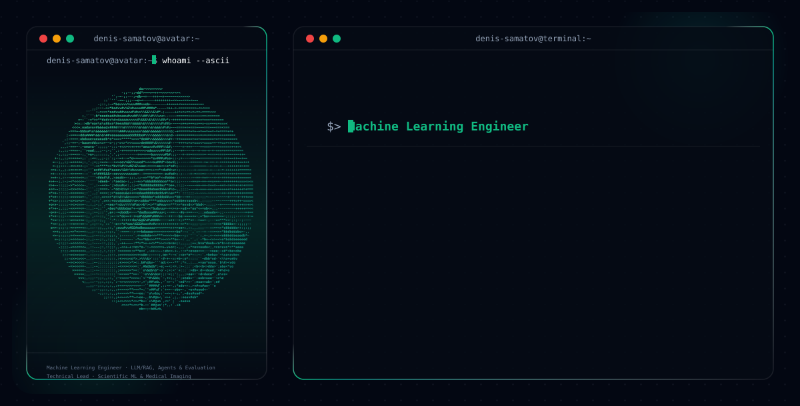

<h1 align="left">Denis Samatov</h1>

**Machine Learning Engineer & Technical Lead · LLM/RAG systems & evaluation · Medical imaging · Scientific ML**

<picture>
  <source media="(prefers-color-scheme: dark)" srcset="readmefile/dark.svg">
  <source media="(prefers-color-scheme: light)" srcset="readmefile/light.svg">
  
</picture>

I build ML systems that can be checked: LLM/RAG assistants with release-blocking evaluation, medical image segmentation with patient-level validation, and scientific ML research software with documented reproducibility. Each project below states what its evidence does and does not show.

[CV (PDF)](Denis_Samatov_CV_ML_Engineer.pdf) · [LinkedIn](https://www.linkedin.com/in/denis-samatov/) · [ORCID](https://orcid.org/0009-0000-1821-323X) · [Google Scholar](https://scholar.google.com/citations?user=GvQy91AAAAAJ)

## Flagship projects

| Project | Area | Evidence in the repository |
|---|---|---|
| [**EPIFAT**](https://github.com/denis-samatov/epicardial-fat-segmentation-software) | Medical imaging | State-registered cardiac CT software (No. 2025610317). Attention U-Net pericardium segmentation, Dice 0.91 on a patient-level split of a 62-patient dataset ([training pipeline](https://github.com/denis-samatov/epicardial-fat-segmentation)). GUI + CLI, manual correction, radiomics, 470 tests |
| [**CourseLLM**](https://github.com/denis-samatov/course-llm) | LLM / RAG | Source-grounded RAG assistant in use; team project I lead. Golden-QA release gate, streaming/queued API, concurrency control, [production-readiness report](https://github.com/denis-samatov/course-llm/blob/main/docs/production_readiness_audit_report.md) |
| [**TBMD**](https://github.com/denis-samatov/tensor-based-modal-decomposition-method) | Scientific ML | Tensor-based modal decomposition and sparse sensor placement library; nested leave-one-scenario-out Brugge benchmark; [reproducibility guide](https://github.com/denis-samatov/tensor-based-modal-decomposition-method/blob/main/REPRODUCIBILITY.md) including an audit of the superseded arXiv v1 results |
| [**NAB**](https://github.com/denis-samatov/neighbourhood-algorithm-bayes) | Bayesian inference | `pip install nab-bayes` — MCMC/Gibbs parameter-space appraisal; CI, Docker image, 470+ tests |
| [**Yandex Workspace MCP**](https://github.com/denis-samatov/yandex-workspace-mcp) | Agent tooling | MCP server for Yandex Disk & Wiki: 50+ typed tools, read-only by default, permission gates, audit logging, contract tests |

More: [housing knowledge-base RAG assistant](https://github.com/denis-samatov/mkd-rag-assistant) (hybrid retrieval, 37-query retrieval regression: Hit@5 1.00, MRR@10 0.89) · [LLM Adviser case study](https://github.com/denis-samatov/llm-adviser-case-study) (platform in development) · [mcp-capguard](https://github.com/denis-samatov/mcp-capguard).

## Merged upstream contributions

- [dragonflydb/dragonfly #8199](https://github.com/dragonflydb/dragonfly/pull/8199) — `FT.INFO` missing-index wording for RedisVL compatibility, with a regression test (merged 2026-09-01).
- [wandb/rai-toolkit #24](https://github.com/wandb/rai-toolkit/pull/24) — HR industry preset, dataset selection, docs and tests (merged 2026-09-02).
- [IBM/docling-pipelines #31](https://github.com/IBM/docling-pipelines/pull/31) — side-effect-free dry runs, with regression and control tests (merged 2026-09-09).

## Experience

- **Machine Learning Engineer / Technical Lead** (teams of 3–5), Analytics and Machine Learning Department, MSUU — Apr 2024 – Present
- **Data Scientist / Research ML Engineer** (part-time), Heriot-Watt TPU Center — Sep 2024 – Present
- **Machine Learning Engineer**, Cardiology Research Institute — Mar 2021 – May 2026

## Research

- [arXiv:2607.09687](https://arxiv.org/abs/2607.09687) — *Tensor-Based Modal Decomposition and Sparse Sensor Placement for the Brugge Field Simulation Model* (v1; revised manuscript with nested validation in preparation).
- Peer-reviewed cardiac MRI radiomics studies: [Digital Diagnostics, 2024](https://jdigitaldiagnostics.com/DD/article/view/630602); Russian Journal of Cardiology, 2026; Siberian Journal of Clinical and Experimental Medicine, 2026.

## Stack

Python · PyTorch · scikit-learn · LangChain / LangGraph · MCP · RAGAS · Qdrant · pgvector · PostgreSQL · Redis · FastAPI · Docker · GitHub Actions · PyRadiomics · tensor methods · MCMC

## Contact

[denissamatov470@gmail.com](mailto:denissamatov470@gmail.com) · Telegram [@SamatovDS](https://t.me/SamatovDS) · Tomsk, Russia — open to remote work and relocation.
