<picture>
  <source media="(prefers-color-scheme: dark)" srcset="readmefile/dark.svg">
  <source media="(prefers-color-scheme: light)" srcset="readmefile/light.svg">
  
</picture>

<picture>
  <source media="(prefers-color-scheme: dark)" srcset="readmefile/profile/intro-dark.svg">
  <source media="(prefers-color-scheme: light)" srcset="readmefile/profile/intro-light.svg">
  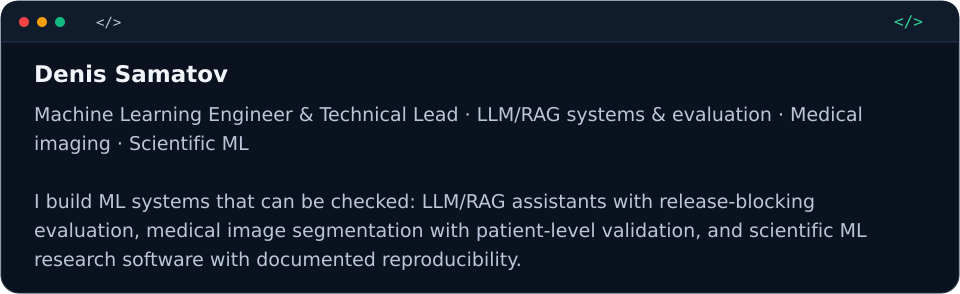
</picture>

<picture>
  <source media="(prefers-color-scheme: dark)" srcset="readmefile/profile/projects-heading-dark.svg">
  <source media="(prefers-color-scheme: light)" srcset="readmefile/profile/projects-heading-light.svg">
  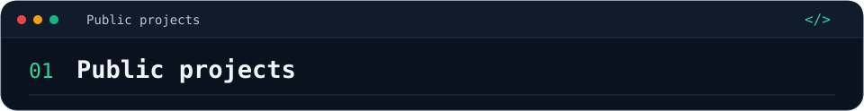
</picture>

<a href="https://github.com/denis-samatov/rumed-icd-llm">
<picture>
  <source media="(prefers-color-scheme: dark)" srcset="readmefile/profile/project-01-dark.svg">
  <source media="(prefers-color-scheme: light)" srcset="readmefile/profile/project-01-light.svg">
  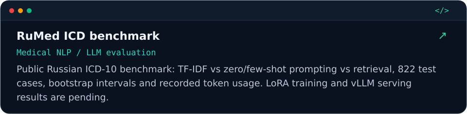
</picture>
</a>

<a href="https://github.com/denis-samatov/tensor-based-modal-decomposition-method">
<picture>
  <source media="(prefers-color-scheme: dark)" srcset="readmefile/profile/project-02-dark.svg">
  <source media="(prefers-color-scheme: light)" srcset="readmefile/profile/project-02-light.svg">
  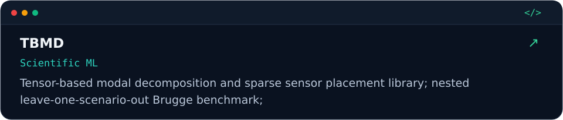
</picture>
</a>

<a href="https://github.com/denis-samatov/tensor-based-modal-decomposition-method/blob/main/REPRODUCIBILITY.md">
<picture>
  <source media="(prefers-color-scheme: dark)" srcset="readmefile/profile/tbmd-reproducibility-dark.svg">
  <source media="(prefers-color-scheme: light)" srcset="readmefile/profile/tbmd-reproducibility-light.svg">
  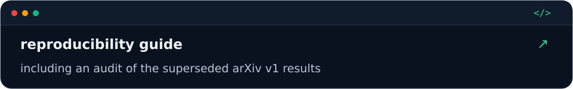
</picture>
</a>

<a href="https://pypi.org/project/nab-bayes/">
<picture>
  <source media="(prefers-color-scheme: dark)" srcset="readmefile/profile/project-03-dark.svg">
  <source media="(prefers-color-scheme: light)" srcset="readmefile/profile/project-03-light.svg">
  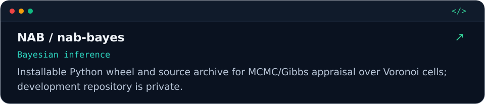
</picture>
</a>

<a href="https://github.com/denis-samatov/yandex-workspace-mcp">
<picture>
  <source media="(prefers-color-scheme: dark)" srcset="readmefile/profile/project-04-dark.svg">
  <source media="(prefers-color-scheme: light)" srcset="readmefile/profile/project-04-light.svg">
  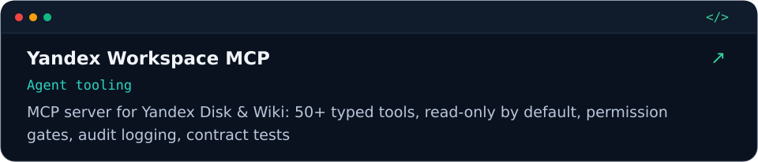
</picture>
</a>

<a href="https://github.com/denis-samatov/llm-adviser-case-study">
<picture>
  <source media="(prefers-color-scheme: dark)" srcset="readmefile/profile/project-05-dark.svg">
  <source media="(prefers-color-scheme: light)" srcset="readmefile/profile/project-05-light.svg">
  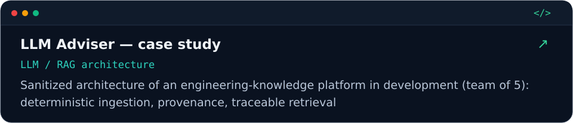
</picture>
</a>

<a href="https://github.com/denis-samatov/mcp-capguard">
<picture>
  <source media="(prefers-color-scheme: dark)" srcset="readmefile/profile/project-06-dark.svg">
  <source media="(prefers-color-scheme: light)" srcset="readmefile/profile/project-06-light.svg">
  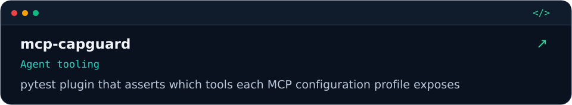
</picture>
</a>

<a href="https://github.com/denis-samatov/agentic-architectures">
<picture>
  <source media="(prefers-color-scheme: dark)" srcset="readmefile/profile/project-07-dark.svg">
  <source media="(prefers-color-scheme: light)" srcset="readmefile/profile/project-07-light.svg">
  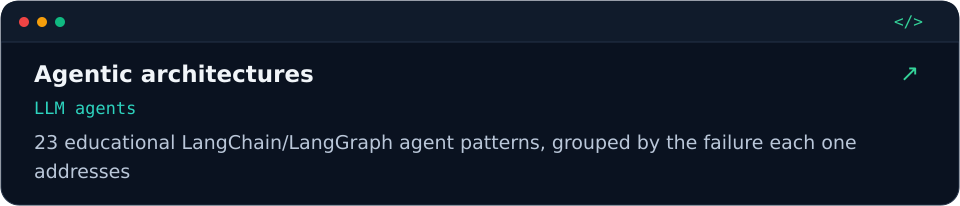
</picture>
</a>

<a href="https://github.com/denis-samatov/ocr-llm-document-pipeline">
<picture>
  <source media="(prefers-color-scheme: dark)" srcset="readmefile/profile/project-08-dark.svg">
  <source media="(prefers-color-scheme: light)" srcset="readmefile/profile/project-08-light.svg">
  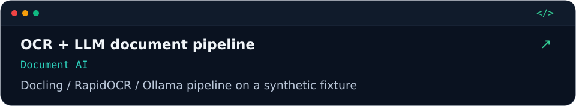
</picture>
</a>

<picture>
  <source media="(prefers-color-scheme: dark)" srcset="readmefile/profile/private-heading-dark.svg">
  <source media="(prefers-color-scheme: light)" srcset="readmefile/profile/private-heading-light.svg">
  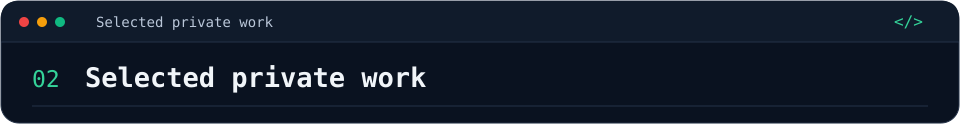
</picture>

<picture>
  <source media="(prefers-color-scheme: dark)" srcset="readmefile/profile/private-context-dark.svg">
  <source media="(prefers-color-scheme: light)" srcset="readmefile/profile/private-context-light.svg">
  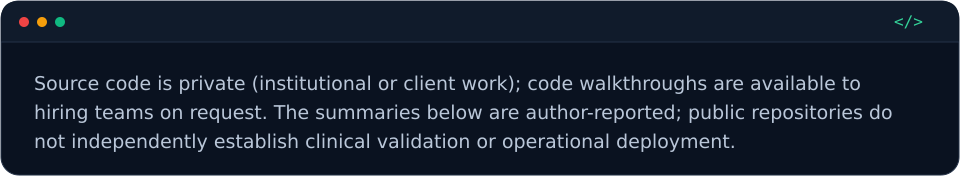
</picture>

<picture>
  <source media="(prefers-color-scheme: dark)" srcset="readmefile/profile/private-01-dark.svg">
  <source media="(prefers-color-scheme: light)" srcset="readmefile/profile/private-01-light.svg">
  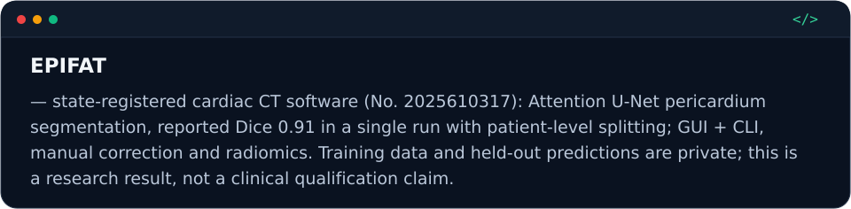
</picture>

<picture>
  <source media="(prefers-color-scheme: dark)" srcset="readmefile/profile/private-02-dark.svg">
  <source media="(prefers-color-scheme: light)" srcset="readmefile/profile/private-02-light.svg">
  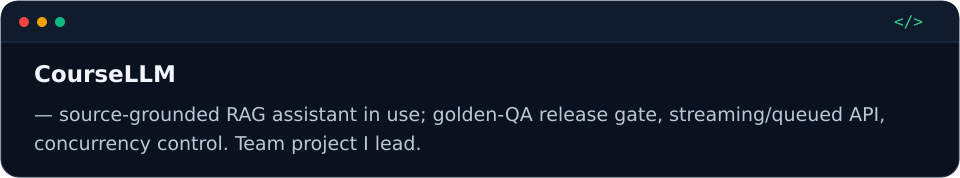
</picture>

<picture>
  <source media="(prefers-color-scheme: dark)" srcset="readmefile/profile/private-03-dark.svg">
  <source media="(prefers-color-scheme: light)" srcset="readmefile/profile/private-03-light.svg">
  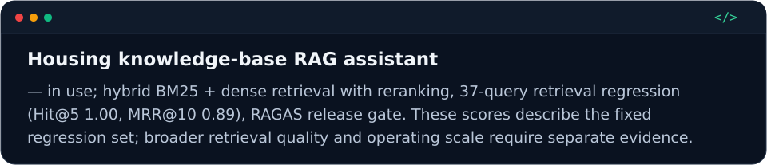
</picture>

<picture>
  <source media="(prefers-color-scheme: dark)" srcset="readmefile/profile/contributions-heading-dark.svg">
  <source media="(prefers-color-scheme: light)" srcset="readmefile/profile/contributions-heading-light.svg">
  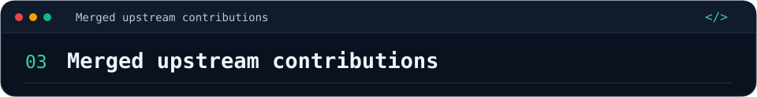
</picture>

<a href="https://github.com/weaviate/weaviate-python-client/pull/2153">
<picture>
  <source media="(prefers-color-scheme: dark)" srcset="readmefile/profile/contribution-01-dark.svg">
  <source media="(prefers-color-scheme: light)" srcset="readmefile/profile/contribution-01-light.svg">
  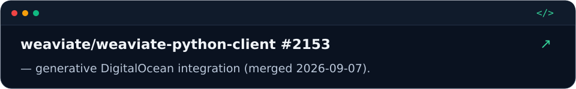
</picture>
</a>

<a href="https://github.com/dragonflydb/dragonfly/pull/8199">
<picture>
  <source media="(prefers-color-scheme: dark)" srcset="readmefile/profile/contribution-02-dark.svg">
  <source media="(prefers-color-scheme: light)" srcset="readmefile/profile/contribution-02-light.svg">
  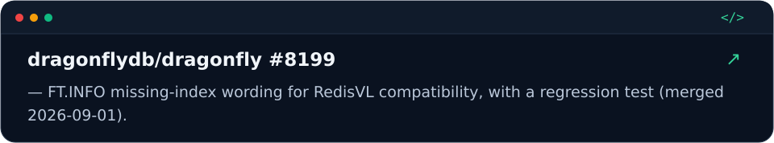
</picture>
</a>

<a href="https://github.com/wandb/rai-toolkit/pull/24">
<picture>
  <source media="(prefers-color-scheme: dark)" srcset="readmefile/profile/contribution-03-dark.svg">
  <source media="(prefers-color-scheme: light)" srcset="readmefile/profile/contribution-03-light.svg">
  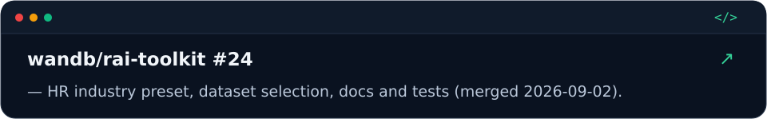
</picture>
</a>

<a href="https://github.com/IBM/docling-pipelines/pull/31">
<picture>
  <source media="(prefers-color-scheme: dark)" srcset="readmefile/profile/contribution-04-dark.svg">
  <source media="(prefers-color-scheme: light)" srcset="readmefile/profile/contribution-04-light.svg">
  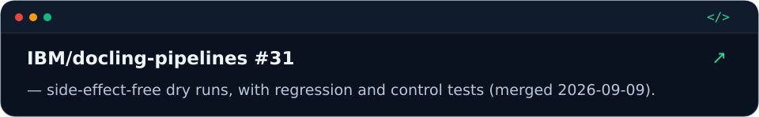
</picture>
</a>

<picture>
  <source media="(prefers-color-scheme: dark)" srcset="readmefile/profile/experience-heading-dark.svg">
  <source media="(prefers-color-scheme: light)" srcset="readmefile/profile/experience-heading-light.svg">
  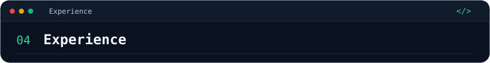
</picture>

<picture>
  <source media="(prefers-color-scheme: dark)" srcset="readmefile/profile/experience-01-dark.svg">
  <source media="(prefers-color-scheme: light)" srcset="readmefile/profile/experience-01-light.svg">
  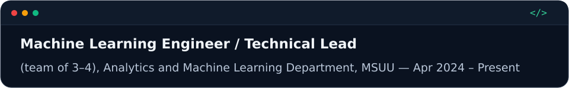
</picture>

<picture>
  <source media="(prefers-color-scheme: dark)" srcset="readmefile/profile/experience-02-dark.svg">
  <source media="(prefers-color-scheme: light)" srcset="readmefile/profile/experience-02-light.svg">
  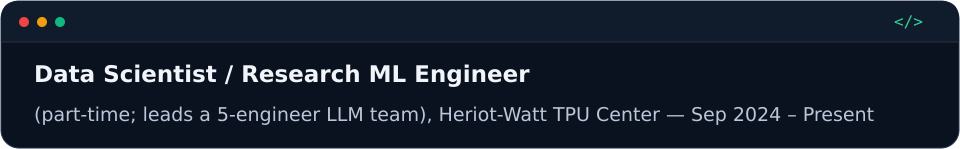
</picture>

<picture>
  <source media="(prefers-color-scheme: dark)" srcset="readmefile/profile/experience-03-dark.svg">
  <source media="(prefers-color-scheme: light)" srcset="readmefile/profile/experience-03-light.svg">
  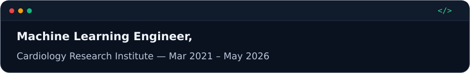
</picture>

<picture>
  <source media="(prefers-color-scheme: dark)" srcset="readmefile/profile/research-heading-dark.svg">
  <source media="(prefers-color-scheme: light)" srcset="readmefile/profile/research-heading-light.svg">
  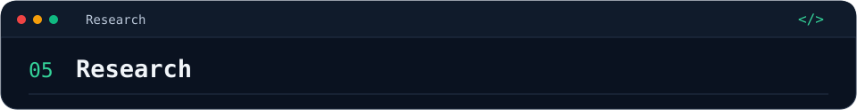
</picture>

<a href="https://arxiv.org/abs/2607.09687">
<picture>
  <source media="(prefers-color-scheme: dark)" srcset="readmefile/profile/research-arxiv-dark.svg">
  <source media="(prefers-color-scheme: light)" srcset="readmefile/profile/research-arxiv-light.svg">
  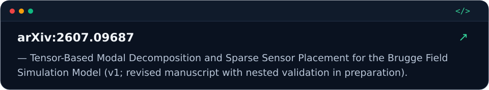
</picture>
</a>

<picture>
  <source media="(prefers-color-scheme: dark)" srcset="readmefile/profile/research-talks-dark.svg">
  <source media="(prefers-color-scheme: light)" srcset="readmefile/profile/research-talks-light.svg">
  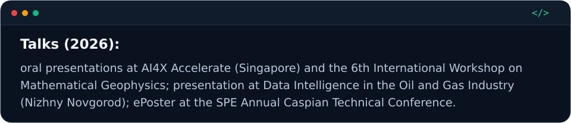
</picture>

<a href="https://jdigitaldiagnostics.com/DD/article/view/630602">
<picture>
  <source media="(prefers-color-scheme: dark)" srcset="readmefile/profile/research-papers-dark.svg">
  <source media="(prefers-color-scheme: light)" srcset="readmefile/profile/research-papers-light.svg">
  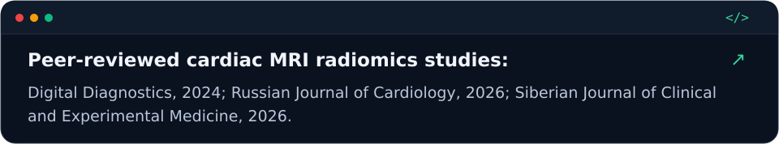
</picture>
</a>

<picture>
  <source media="(prefers-color-scheme: dark)" srcset="readmefile/profile/stack-heading-dark.svg">
  <source media="(prefers-color-scheme: light)" srcset="readmefile/profile/stack-heading-light.svg">
  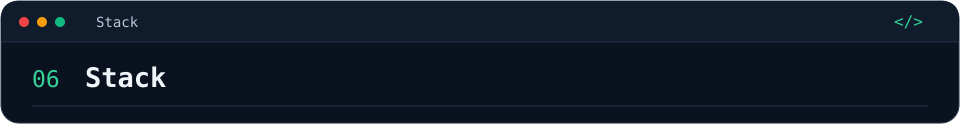
</picture>

<picture>
  <source media="(prefers-color-scheme: dark)" srcset="readmefile/profile/stack-dark.svg">
  <source media="(prefers-color-scheme: light)" srcset="readmefile/profile/stack-light.svg">
  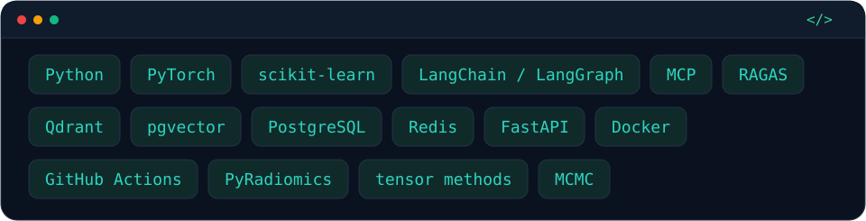
</picture>

<picture>
  <source media="(prefers-color-scheme: dark)" srcset="readmefile/profile/contact-heading-dark.svg">
  <source media="(prefers-color-scheme: light)" srcset="readmefile/profile/contact-heading-light.svg">
  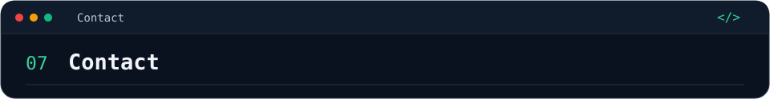
</picture>

<a href="Denis_Samatov_CV_ML_Engineer.pdf"><picture><source media="(prefers-color-scheme: dark)" srcset="readmefile/profile/contact-cv-dark.svg"><source media="(prefers-color-scheme: light)" srcset="readmefile/profile/contact-cv-light.svg"></picture></a>
<a href="https://www.linkedin.com/in/denis-samatov/"><picture><source media="(prefers-color-scheme: dark)" srcset="readmefile/profile/contact-linkedin-dark.svg"><source media="(prefers-color-scheme: light)" srcset="readmefile/profile/contact-linkedin-light.svg"></picture></a>
<a href="https://orcid.org/0009-0000-1821-323X"><picture><source media="(prefers-color-scheme: dark)" srcset="readmefile/profile/contact-orcid-dark.svg"><source media="(prefers-color-scheme: light)" srcset="readmefile/profile/contact-orcid-light.svg"></picture></a>
<a href="https://scholar.google.com/citations?user=GvQy91AAAAAJ"><picture><source media="(prefers-color-scheme: dark)" srcset="readmefile/profile/contact-scholar-dark.svg"><source media="(prefers-color-scheme: light)" srcset="readmefile/profile/contact-scholar-light.svg"></picture></a>
<a href="https://github.com/denis-samatov"><picture><source media="(prefers-color-scheme: dark)" srcset="readmefile/profile/contact-github-dark.svg"><source media="(prefers-color-scheme: light)" srcset="readmefile/profile/contact-github-light.svg"></picture></a>
<a href="mailto:denissamatov470@gmail.com"><picture><source media="(prefers-color-scheme: dark)" srcset="readmefile/profile/contact-email-dark.svg"><source media="(prefers-color-scheme: light)" srcset="readmefile/profile/contact-email-light.svg"></picture></a>
<a href="https://t.me/SamatovDS"><picture><source media="(prefers-color-scheme: dark)" srcset="readmefile/profile/contact-telegram-dark.svg"><source media="(prefers-color-scheme: light)" srcset="readmefile/profile/contact-telegram-light.svg"></picture></a>

<picture>
  <source media="(prefers-color-scheme: dark)" srcset="readmefile/profile/contact-location-dark.svg">
  <source media="(prefers-color-scheme: light)" srcset="readmefile/profile/contact-location-light.svg">
  
</picture>
